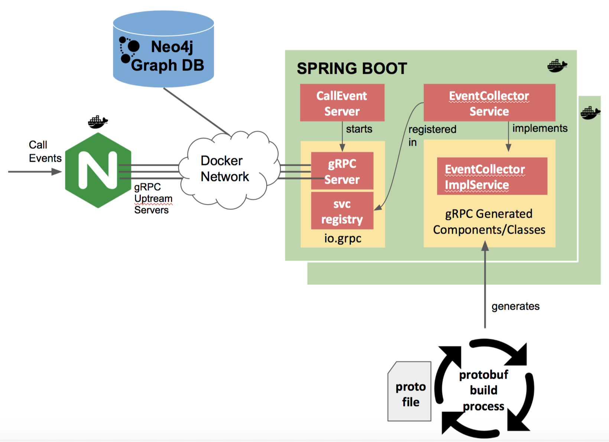

# Call Event Service

A data collector of voice call events.  

* Mobile Network Code (MNC) 
* Mobile Country Code (MCC) 
* Network Name (e.g. T-Mobile / AT&T)
* Network Type (e.g. 2G/3G), or LTE for VoLTE
* Signal DBM
* Signal ASU
* Device Brand
* Device Model
* OS Name
* OS Version
* Latitude
* Longtitude

This service is a prototype to integrate the following technologies:
1. Spring Boot - run and configure application
2. gRPC - RPC protocol framework 
3. Docker - package/run the application in a container and use docker networking
4. NGINX - load balancer / application gateway 
 
## Technical Design

## Build

Prerequisite: Install **Java 1.8 SDK**, **Git**, **Maven**, **Docker**, **call-event-proto**.
See  https://github.com/CNAChino/call-event-proto to install call-event-proto.   

1.  Get the source code
  `$ git clone https://github.com/CNAChino/call-event-service.git`
2.  Compile and Package Jar file
  `$ mvn package` or
  `$ mvn clean package`
  This will compile, create the application jar file and create the docker image.  The following command can be used to manually build the docker image. 
  `$ docker build -t {docker.image.name.prefix}/{project.artifactId}:{tag} .`
 
  where, **docker.image.name.prefix** and **project.artifactId** are set in `pom.xml`. 
  `<tag>` is `project.version` from pom.xml.
 
  To **remove the image from your docker local repository**, run the following command:
 
  `$ docker image rm <docker.image.name.prefix>/<project.artifactId>:<tag>`
 
    
 

## Run the Application

To run the docker image, execute:

`$ docker run -it -p <host-port>:9090 -v <host-local-log-dir>:/app/logs <docker.image.name.prefix>/<project.artifactId>:<tag>`
  
   where,
 * **docker.image.name.prefix** and **project.artifactId** are set in `pom.xml`. 
 * `<tag>` is `project.version` from pom.xml.
 * `<host-port>` is port to listen to in your host operating system.
 * `<host-local-log-dir>` is path to a file directory in your host operating system.
   
   Note:  Inside the docker container,  the application listens in port **9090** and working directory is **/app**